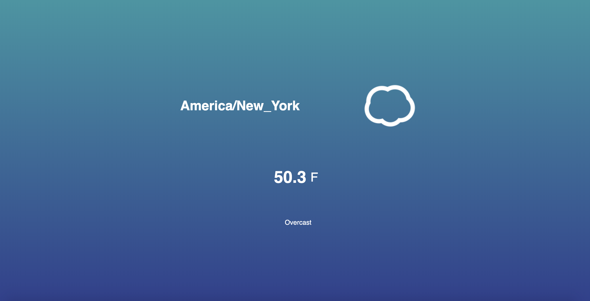

# Weather-App
https://bbrier14.github.io/Weather-App/
## Overview
The Weather App is a basic Javascript application that gives the user the current weather at their location.
## How it Works
The user will click on the link above and give the site permission to use their location. The App will display the current location, temperature in fahrenheit, an icon representing the weather, and a short description of the weather. The user can click on the temperature to change it to Celsius, and click again to revert back to fahrenheit.
## Technologies Used
This application primarily uses Javascript. The API for the weather and the icons is from Dark Sky. 
## Role
This is a solo project.
## Screenshots

